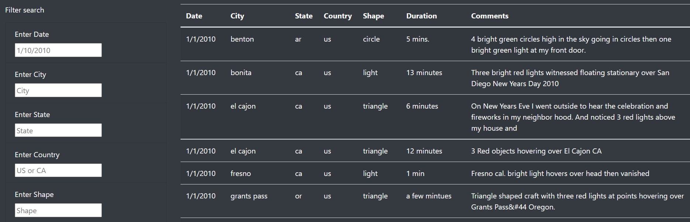
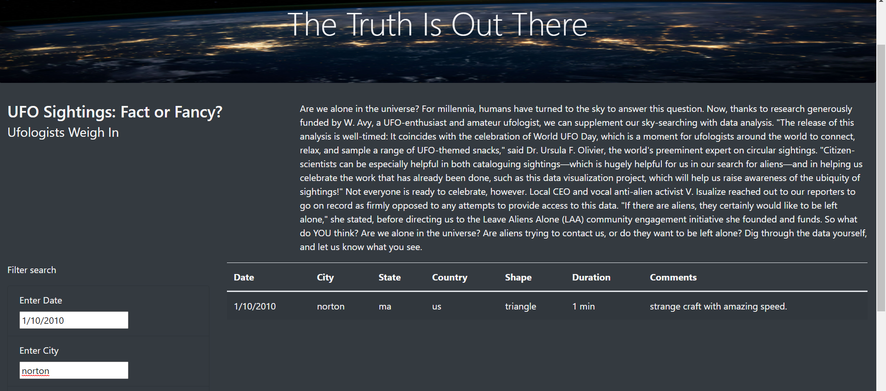

# UFOs
UFO Sightings with JavaScript

## Purpose:
The request from a client was to display a table organizing UFO data stored as a JavaScript array. The client wanted the ability to filter by multiple criteria creating a dynamic website. The table was created using JavaScript, while HTML/CSS and Bootstrap were used to modify the aesthetics of the website.

## Results
When a user first views the webpage, all information in the table is displayed. The user can then filter down the table results using the five categories to filter. As one filter is entered, the data in the table is reduced to contain those items that match the input criteria. The table can be further refined by adding in additional filters.Welcome to UFO Sightings!

### Welcome to UFO Sightings!

### How the filters appear when first landing on the page:

* 1.To start to use the filter we need to type in the placeholder elements the suggested text. By typed the 1/1/2010 we retrieved multiple match rows with the date we typed. 

## Summary

One drawback from this code is that values must be entered in as they appear in the table(capitalization). Entering "US" will yield no results. The code can be improved in multiple ways for example Accepting upper- or lower-case values. by the way the filter can retrieve data by multiple criteria in the website. 

